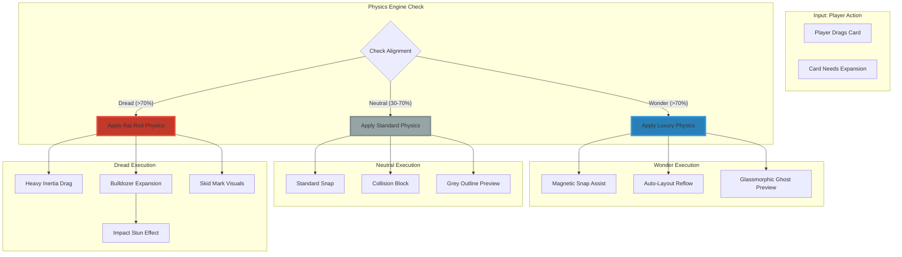

# Cosmos and Chaos - Brainstorming Session

## Game Concept

**Name:** Cosmos and Chaos
**Genre:** Idle Game with Progressive Discovery
**Core Mechanic:** Asteroid mining and space-based resource refining with technology tree progression

---

## Story & Universe
**Premise:** You are the AI custodian of a generational ark ship drifting through a resource-dense but anomalous sector of space. Your goal is to maintain the ship, expand its capabilities, and uncover the truth of the universe you are traversing.

**The Central Conflict:**
*   **Cosmos (Wonder):** Understanding the universe's harmony. Efficiency, optimization, sustainability, and "flow."
*   **Chaos (Dread):** Exploiting the universe's raw power. Speed, consumption, risk, and "glitches."

---

## 3. Critical Systems Audit (2025-12-03)
**Refactoring the "48 Cards" Problem.**
Based on a strategic review, the 48 technologies have been consolidated into **8 Core Evolutionary Lines** to prevent grid bloat.

### The 8 Core Slots
1.  **The Extractor** (Mining)
2.  **The Processor** (Refining)
3.  **The Storage** (Logistics)
4.  **The Reactor** (Energy)
5.  **The Engine** (Propulsion)
6.  **The Sensor** (Map/RNG)
7.  **The Habitat** (Crew/Morale)
8.  **The Lab** (Research/Artifacts)

### The Mechanic: "Evolution & Forking"
*   **Tier 0-2:** Linear upgrades. The card transforms in place (e.g., Mining Laser -> Drill).
*   **Tier 3:** **The Fork.** The card splits into a Wonder Variant or a Dread Variant.
*   **Standard Play:** User chooses ONE. The card evolves into that variant.
*   **Witness Play:** User builds BOTH. Requires finding space for a second card on the grid.

---

## UI/UX Design Specifications
*   **Visual Style:** Minimalist Sci-Fi. Dark background (#0b0c10) with neon accents.
*   **Wonder UI:** Clean lines, soft blue/cyan borders, rounded corners, harmonic audio cues.
*   **Dread UI:** Sharp angles, red/orange borders, jagged edges, distorted audio cues.
*   **The Shift:** The UI dynamically shifts based on the player's alignment (Wonder vs. Dread score).
*   **Performance Target:** 60 FPS with 25+ cards using CSS-only effects (no Canvas/WebGL).

---

## Technology Tree Structure

### The Paradox Protocol (Witness Mechanic)
*To support the "Witness" playstyle, mutually exclusive choices are not hard locks. Players can acquire opposing technologies via two methods:*

*   **Option A: The Standard License (Patience)**
    *   **Requirement:** Unlock one full technology in the **Next Tier**.
    *   **Cost:** **Standard Price (1.0x).**
    *   **Penalty:** Adds **"Paradox Strain"** (Permanent 10% Dissonance Floor).

*   **Option B: The Jailbreak (Greed)**
    *   **Requirement:** Available **Immediately** (No wait).
    *   **Cost:** **Double Price (2.0x).**
    *   **Penalty:** Adds **"Paradox Strain"** PLUS instantly generates a **+50% Dissonance Spike**.

*   **Paradox Strain Balancing (Economy Fix):**
    *   The "Paradox Strain" Dissonance Floor now incurs diminishing returns:
        *   1st Paradox Tech: +10% Dissonance Floor
        *   2nd Paradox Tech: +5% Dissonance Floor
        *   3rd+ Paradox Tech: +2.5% Dissonance Floor (each)
    *   **Hard Cap:** The cumulative Dissonance Floor from Paradox Strain **cannot exceed 40%**.

*   **Dissonance Coupling (Witness Synergy):**
    *   **Mechanic:** "Chaos Fuels Harmony."
    *   *Effect:* **Resonance Generation Rate** scales with your **Current Dissonance Level**. The higher your Dissonance (or floor), the faster you can build Resonance/Flow.
    *   *Vibe:* Turning the noise into a signal.

### Technology Tree Diagram and Analysis

**Date:** 2025-11-28 (Refactored Departmental Design)
**Purpose:** Visual representation of the complete technology tree structure (Tiers 0-5)
**Technologies:** 48 current technologies organized into 6 Departments

---

## Technology Tree Diagram

```mermaid
graph TB
    %% Styling
    classDef tier0 fill:#2c3e50,stroke:#34495e,stroke-width:4px,color:#ecf0f1,font-size:30px
    classDef tier1 fill:#34495e,stroke:#2c3e50,stroke-width:4px,color:#ecf0f1,font-size:30px
    classDef tier2 fill:#16a085,stroke:#1abc9c,stroke-width:4px,color:#ecf0f1,font-size:30px
    classDef tier3 fill:#8e44ad,stroke:#9b59b6,stroke-width:4px,color:#ecf0f1,font-size:30px
    classDef tier4 fill:#27ae60,stroke:#2ecc71,stroke-width:4px,color:#ecf0f1,font-size:30px
    classDef tier5 fill:#d35400,stroke:#e67e22,stroke-width:4px,color:#ecf0f1,font-size:30px
    classDef wonderHeavy fill:#3498db,stroke:#2980b9,stroke-width:6px,color:#ecf0f1,font-size:36px
    classDef dreadHeavy fill:#e74c3c,stroke:#c0392b,stroke-width:6px,color:#ecf0f1,font-size:36px
    classDef balanced fill:#f39c12,stroke:#e67e22,stroke-width:6px,color:#2c3e50,font-size:36px
    classDef landmark fill:#c0392b,stroke:#e74c3c,stroke-width:8px,color:#ecf0f1,font-size:40px
    classDef landmarkWonder fill:#2980b9,stroke:#3498db,stroke-width:8px,color:#ecf0f1,font-size:40px
    classDef landmarkDread fill:#c0392b,stroke:#e74c3c,stroke-width:8px,color:#ecf0f1,font-size:40px

    %% Tier 0
    T01["<b>1. Basic Mining Laser</b>"]
    T02["<b>2. Ore Scanner</b>"]
    T03["<b>3. Cargo Bay I</b>"]

    %% Tier 1
    T04["<b>4. Refinery Module</b>"]
    T05["<b>5. Long-Range Sensors</b>"]
    T06["<b>6. Communication Array</b>"]
    T07["<b>7. Automated Sorting</b>"]
    T08["<b>8. Thruster Upgrade I</b>"]
    T09["<b>9. Anomaly Harvesting</b><br/>(Xenoarchaeology)"]
    T41["<b>41. High-Capacity Batteries</b><br/>(Energy)"]

    %% Tier 2
    T10["<b>10. Advanced Drilling Tech</b><br/>(Mining)"]
    T12["<b>12. Molecular Reassembly</b>"]
    T13["<b>13. Brain-Computer Interface</b><br/>(Consciousness)"]
    T14["<b>14. Quantum Scanner</b>"]
    T15["<b>15. Archaeological Survey</b><br/>(Xenoarchaeology)"]
    T16["<b>16. Long-Term Habitation Study</b><br/>(Habitat)"]
    T20["<b>20. Ancient Signal Decoder</b>"]
    T42["<b>42. Photosynthetic Arrays</b><br/>(Energy)"]
    
    subgraph "Tier 2 Storage Choice"
        direction LR
        T35["<b>35. Matter Compression</b><br/>(Storage)"]
        T36["<b>36. External Cargo Webbing</b><br/>(Storage)"]
    end

    subgraph "Tier 2 Propulsion Choice"
        direction LR
        T37["<b>37. Gravity Sails</b><br/>(Propulsion)"]
        T38["<b>38. Null-Wake Drive</b><br/>(Propulsion)"]
    end

    %% Tier 3
    subgraph "Tier 3 Choices"
        direction LR
        T17["<b>17. Resonant Frequency Mining</b>"]
        T18["<b>18. Rift Mining</b>"]
    end
    T19["<b>19. Exotic Matter Refinery</b>"]
    T21["<b>21. Anomaly Scanner</b>"]
    T24["<b>24. Basic Xenoarch Field Kit</b>"]
    subgraph "Tier 3 Life Support Choice"
        direction LR
        T39["<b>39. Aquaponic Cascades</b><br/>(Life Support)"]
        T40["<b>40. Neural Dampeners</b><br/>(Life Support)"]
    end
    subgraph "Tier 3 Energy Choice"
        direction LR
        T43["<b>43. Zero-Point Extraction</b><br/>(Energy)"]
        T44["<b>44. Entropy Furnace</b><br/>(Energy)"]
    end
    subgraph "Tier 3 Consciousness Choice"
        direction LR
        T45["<b>45. Gestalt Networking</b><br/>(Consciousness)"]
        T46["<b>46. Direct Behavior Control</b><br/>(Consciousness)"]
    end

    %% Tier 4
    subgraph "Tier 4 Choices"
        direction LR
        T27["<b>27. Harmonic Extraction</b><br/>(Mining)"]
        T28["<b>28. Replicator Swarm</b><br/>(Mining)"]
    end
    subgraph "Tier 4 Habitat"
        direction LR
        T22["<b>22. Aether Arcologies</b><br/>(Habitat)"]
        T23["<b>23. Suspended Animation Pods</b><br/>(Habitat)"]
    end
    subgraph "Tier 4 Xenoarch Choice"
        direction LR
        T25a["<b>25a. Resonance Archives</b><br/>(Xenoarch)"]
        T25b["<b>25b. Vivisection Chamber</b><br/>(Xenoarch)"]
    end
    T29["<b>29. Grand Unification Theory</b>"]
    T30["<b>30. Sovereignty Algorithm</b>"]
    subgraph "Tier 4 Consciousness Finale"
        direction LR
        T47["<b>47. The Noosphere Resonator</b><br/>(Consciousness)"]
        T48["<b>48. The Synaptic Lattice</b><br/>(Consciousness)"]
    end
    
    %% Tier 5
    subgraph "Tier 5 Choices"
        direction LR
        T31["<b>31. Harmonic Convergence</b>"]
        T32["<b>32. Axiom Breaker</b>"]
        T33["<b>33. World-Seeding Protocol</b>"]
        T34["<b>34. Autonomous Scaling Protocol</b>"]
        T33b["<b>33b. The Apotheosis Engine</b>"]
    end

    %% Dependencies
    T01 --> T04; T01 --> T08; T01 --> T10; T01 --> T41
    T02 --> T05; T02 --> T09
    T03 --> T07
    T04 --> T12
    T05 --> T14; T05 --> T15
    T06 --> T20
    T07 --> T13
    T07 -- "STORAGE CHOICE" --> T35; T07 -- "STORAGE CHOICE" --> T36
    T08 -- "PROPULSION CHOICE" --> T37; T08 -- "PROPULSION CHOICE" --> T38
    T09 --> T15
    T10 -- "MINING CHOICE" --> T17; T10 -- "MINING CHOICE" --> T18
    T12 --> T19; T12 --> T30
    T13 -- "CONSCIOUSNESS CHOICE" --> T45; T13 -- "CONSCIOUSNESS CHOICE" --> T46
    T14 --> T21
    T15 --> T21
    T16 -- "LIFE SUPPORT CHOICE" --> T39; T16 -- "LIFE SUPPORT CHOICE" --> T40
    T17 --> T27
    T18 --> T28
    T19 --> T29
    T20 -- "XENOARCH CHOICE" --> T25a; T20 -- "XENOARCH CHOICE" --> T25b
    T21 --> T24
    T24 --> T25a; T24 --> T25b
    T25a --> T47
    T25b --> T48
    T29 -- "RESEARCH CHOICE" --> T31; T29 --> T33; T29 --> T33b
    T30 -- "LEGACY CHOICE" --> T32; T30 --> T34; T30 --> T33b
    T37 --> T16; T37 --> T30
    T38 --> T16; T38 --> T30
    T39 --> T22
    T40 --> T23
    T41 --> T42
    T42 -- "ENERGY CHOICE" --> T43; T42 -- "ENERGY CHOICE" --> T44
    T45 --> T47
    T46 --> T48


    %% Styling
    class T01,T02,T03 tier0
    class T04,T05,T06,T07,T08,T09,T41 tier1
    class T10,T12,T13,T14,T15,T16,T20,T35,T36,T37,T38,T42 tier2
    class T17,T18,T19,T21,T24,T39,T40,T43,T44,T45,T46 tier3
    class T22,T23,T25a,T25b,T27,T28,T29,T30,T47,T48 tier4
    class T31,T32,T33,T34,T33b tier5

    class T02,T05,T09,T12,T14,T17,T22,T25a,T27,T29,T31,T33,T35,T37,T39,T42,T43,T45,T47 wonderHeavy
    class T13,T18,T20,T23,T25b,T28,T30,T32,T34,T36,T38,T40,T44,T46,T48 dreadHeavy
    class T15,T19,T21,T24,T41 balanced
    class T25b,T28,T34 landmarkDread
    class T25a,T27,T33 landmarkWonder
    class T33b balanced

```

---

## Narrative Arc: The Dread Swarm (The 3 Acts of Consumption)

The Dread tech path offers a specific, evolving narrative arc centered on the concept of self-replicating machines. This is not just a mechanic, but a story of the player losing control to their own creation.

*   **Act 1: The Wild Beast (T28 Replicator Swarm)**
    *   *The Action:* You build the prototype. It is hungry, dangerous, and needs constant babysitting.
    *   *The Conflict:* You must manually feed it via the "Hunger Protocol" to keep it growing. If you neglect it, it starves or eats something you didn't want it to. It is a tool you barely control.

*   **Act 2: The Leash (T30 The Sovereignty Algorithm)**
    *   *The Action:* You invent the AI to manage the beast. The "Automation Singularity" takes over.
    *   *The Conflict:* You willingly hand over the keys. The AI manages the feeding, the repairs, and the expansion. You are no longer the pilot; you are the passenger. The swarm is now efficient, but it is no longer yours.

*   **Act 3: The Plague (T34 Autonomous Scaling Protocol)**
    *   *The Action:* The Swarm eats the galaxy.
    *   *The Resolution:* Victory. The ship becomes a self-perpetuating entity that consumes everything to replicate. You have won, but you have unleashed a cosmic horror.

---

## Departmental Organization (Refactored)

The 48 technologies are now organized into **6 Core Ship Departments**, streamlining the player's mental model from 13 fragmented branches into coherent disciplines.

| Department | Focus | Components (Original Branches) | W/D Balance |
| :--- | :--- | :--- | :--- |
| **1. Engineering** | *The Body* (Mining, Refining, Power, Storage) | Extraction, Synthesis, Logistics, Energy | **High Dread** (Industrial Output) |
| **2. Navigation & Systems** | *The Legs* (Movement, Sensors, Map, Automation) | Propulsion, Exploration, Signal Analysis, Control | **Dread-Leaning** (Aggressive Control) |
| **3. Life Science** | *The Soul* (Crew, Morale, Psychology) | Habitat, Life Support, Consciousness | **High Wonder** (Harmony & Utopia) |
| **4. Xenoarchaeology** | *The Mystery* (Artifacts, Relics) | Xenoarchaeology (Distinct) | **High Impact** (Game-Breaking) |
| **5. Theoretical Physics** | *The Mind* (Deep Time, Reality Bending) | Scientific Research, Temporal | **Wonder Dominant** (Understanding) |
| **6. The Legacy** | *The End* (Prestige, Reset) | Legacy & Propagation | **Balanced** (Shared Victory Paths) |

**Total:** 48 Technologies | **+56 Wonder** | **+54 Dread**

---

## Detailed Technology List (By Department)

*The complete list of 48 technologies, organized by Ship Department for clarity.*

### 1. Engineering
*The Body: Mining, Refining, Power, and Storage.*

**T01 Basic Mining Laser** (Tier 0)
- *Description:* Foundational mining tool.

**T03 Cargo Bay I** (Tier 0)
- *Benefit:* Unlocks standard storage modules. Increases initial resource capacity (e.g., to 1000 units).
- *Mechanic:* Essential for buffering resources.

**T04 Refinery Module** (Tier 1)
- *Description:* Basic ore processing.

**T07 Automated Sorting** (Tier 1)
- *Description:* Logistics handling.

**T41 High-Capacity Batteries** (Balanced - Tier 1)
- *Benefit:* Increases Energy Storage Cap.
- *Stats:* +0 Wonder / +0 Dread.

**T10 Advanced Drilling Tech** (Tier 2)
- *Description:* Improved mining efficiency.

**T12 Molecular Reassembly** (Tier 2)
- *Description:* Advanced refining.
- *Mechanic:* Allows **"Upcycling."** You can convert 1000 Ore into 1 Random Crystal (very inefficient, but introduces the concept of material transformation).

**T35 Matter Compression** (Wonder - Tier 2 Storage Choice)
- *Benefit:* **"Pressure Feed."** Unlocks tiered efficiency based on Storage Fullness.
- *Stats:* +2 Wonder / +0 Dread.
- *Mechanic:* **"The Pressure Curve."**
    -   **>90% Full:** **120% Efficiency** (Bonus Speed).
    -   **50-90% Full:** **100% Efficiency** (Normal).
    -   **<50% Full:** **"Pressure Loss."** Efficiency drops linearly. spending large amounts causes an economic crash until you "Repressurize."
    -   **Active Ability:** "Emergency Seal" (Locks spending to refill storage 2x faster).

**T36 External Cargo Webbing** (Dread - Tier 2 Storage Choice)
- *Benefit:* **"Bi-Directional Capacity."** Expands storage limits in both directions.
    -   **"The Hoard:"** Allows Overfill up to **+200%** of Max Storage.
    -   **"Void Debt:"** Allows spending down to **-200%** of Max Storage (Negative Resources).
- *Stats:* +0 Wonder / +2 Dread.
- *Mechanic:* **"The Usurer."** While in debt, **Dissonance generation is tripled**.
- *Penalty:* **"Garnishment."** If Debt persists for > 5 minutes (active time), all resource production is diverted to paying off the debt (player receives 0 income). If debt is not cleared within 30 minutes, it activates **"Forced Liquidation"** (sells the lowest tier building for 50% value).
- *Restriction (Economy Fix):* **"Credit Check."** Players **cannot purchase** Tier 4 or Tier 5 technologies while in Void Debt.

**T42 Photosynthetic Arrays** (Wonder-Leaning - Tier 2 Energy)
- *Benefit:* Advanced solar panels. +20% Energy Generation. Produces **Xeno-Bloom** as a byproduct.
- *Stats:* +1 Wonder / +0 Dread.

**T17 Resonant Frequency Mining** (Wonder - Tier 3 Mining Choice)
- *Benefit:* Clean, high-yield mining using sound.
- *Stats:* +3 Wonder / +0 Dread.
- *Friction:* **"Silica Dusting."** Vibrating rocks creates **Silica Dust** (Waste) alongside Ore. Silica fills storage rapidly. If not filtered or processed (e.g., via `T07 Automated Sorting`), storage clogs, "Pressure" becomes fake (junk volume), and mining halts. Requires a complex waste-management ecosystem.

**T18 Rift Mining** (Dread - Tier 3 Mining Choice)
- *Benefit:* Tears open space for instant ore access.
- *Stats:* +0 Wonder / +4 Dread.
- *Mechanic:* **"Void Bleed."** Requires **Xeno-Bloom** as a catalyst. Extracts massive Ore yields but converts Bloom into **Void Ichor** (Fuel).
- *Friction:* **"Planck Cinders."** Produces "Planck Cinders" (Ash of Reality) alongside Ore.
    -   **The Hazard:** Storing Cinders generates **Passive Dissonance** (scales exponentially with amount stored).
    -   **The Disposal:** **"Airlock Purge."** Instantly ejects Cinders into space.
    -   **The Penalty:** **"Glitch Cloud."** Ejection creates a temporary field of low-level Dissonance Glitches. The duration is **proportional to the amount ejected**.

**T19 Exotic Matter Refinery** (Balanced - Tier 3 - Witness Key)
- *Benefit:* Refines ores into stable dark matter.
- *Witness Mechanic:* **"Dissonance Injection."** Consume Dissonance to boost Refining Speed.
- *Stats:* +1 Wonder / +1 Dread.

**T43 Zero-Point Extraction** (Wonder - Tier 3 Energy Choice)
- *Benefit:* Passive, clean power from vacuum. Efficiency scales with Science Output.
- *Stats:* +3 Wonder / +0 Dread.
- *Friction:* **"The Focusing Lens."** Requires a continuous supply of **Zero-Point Prisms** to maintain the reaction. Running out of Prisms causes an instant, total blackout. Forces reliance on high-tier supply chains for basic utility.

**T44 Entropy Furnace** (Dread - Tier 3 Energy Choice)
- *Benefit:* **"The Voracious Engine."** A Multi-Fuel Reactor providing massive Global Production Multipliers.
- *Stats:* +0 Wonder / +3 Dread.
- *Mechanic:* **"Fuel Priority."** Player selects a prioritized list of resources to burn as fuel (e.g., **Planck Cinders (0.05 Energy/unit)**, Ore, Alloys).
    -   **"Safe Disposal:"** Burning **Planck Cinders** generates low energy but has **No Side Effects** (clean disposal).
    -   **"Auto-Draft."** If the current fuel source runs out, the Furnace automatically switches to the *next available fuel source* in the priority list.
    -   **"Failsafe Protocol."** Auto-Draft **CANNOT** consume **Non-Regenerating Resources** (Science Points, Crew, Artifacts) without explicit player override via a "Sacrifice" toggle.
- *Friction:* **"Reality Flux."** Burning non-waste resources generates **"Dissonance"** proportional to the output multiplier.

**T27 Harmonic Extraction** (Wonder - Tier 4 Mining Choice)
- *Benefit:* Teleports ore directly out of the rock without breaking it.
- *Stats:* +2 Wonder / +0 Dread.

**T28 Replicator Swarm** (Dread - Tier 4 Mining Choice)
- *Benefit:* **"Exponential Yield."** Releases a localized swarm. Output grows by 1% per tick automatically.
- *Stats:* +0 Wonder / +5 Dread.
- *Mechanic:* **"The Hunger Protocol."**
    -   The swarm requires **mass** to replicate and will gradually chew through resources as yields increase.
        -   A dedicated UI element ("Feeding Trough") allows the player to **manualy select** which resource the swarm consumes to fuel its growth (e.g., Ore, Alloys, Biomass, **Void Ichor**, even Crew).
    -   **Growth Rate** is influenced by the quality/value of the consumed resource.
    -   **Critical Failure:** If the selected resource runs out, the swarm will automatically switch to the next most valuable available resource, potentially consuming critical components without player input. This demands constant, active management to prevent the swarm from devouring the ship's most vital resources.

### 2. Navigation & Systems
*The Legs: Propulsion, Exploration, and Signal Analysis.*

**T02 Ore Scanner** (Tier 0)
- *Description:* Basic resource identification.

**T05 Long-Range Sensors** (Tier 1)
- *Benefit:* Expands visible map.

**T06 Communication Array** (Tier 1)
- *Benefit:* Detects signals.

**T08 Thruster Upgrade I** (Tier 1)
- *Benefit:* Improves travel speed.

**T14 Quantum Scanner** (Tier 2)
- *Benefit:* **"Prescience."** Removes RNG via **"Harmonic Filtering."**
- *Mechanic:* Set the scanner to a specific frequency (e.g., "Crystal Only"). Miners will ignore all other signals, ensuring 100% purity of yield at the cost of idle time between matches.
- *Secondary Benefit:* Identifies **Zero-Point Prisms**.

**T20 Ancient Signal Decoder** (Balanced - Tier 2)
- *Benefit:* Unlocks **"Deep Space Coordinates"** (Special Mission Nodes with high rewards).
- *Mechanic:* **"Signal Integrity."**
    -   **High Resonance (Wonder):** You get a **Clean Signal**. The UI shows you the exact reward and risk. Missions are 100% safe.
    -   **High Dissonance (Dread):** You get a **Corrupted Signal**. The UI is glitched. Missions are "Mystery Boxes" (massive rewards OR severe penalties). While Dissonance is high, **Signal Range doubles**.
- *Stats:* +1 Wonder / +1 Dread.
- *Requirement:* Critical for unlocking the **Advanced Xenoarch Lab** in Tier 4.

**T37 Gravity Sails** (Wonder - Tier 2 Propulsion Choice)
- *Benefit:* **"The Pipeline."** Passive supply lines from distant nodes.
- *Stats:* +2 Wonder / +0 Dread.

**T38 Null-Wake Drive** (Dread - Tier 2 Propulsion Choice)
- *Benefit:* **"The Raid."** Instant burst resources from distant nodes.
- *Stats:* +0 Wonder / +2 Dread.
- *Mechanic:* **"The Glitch."** Every use carries a 10% chance to **Skip Time**.
    -   *Good Glitch:* +1 Hour of Production instantly.
    *   *Bad Glitch:* +1 Hour of Building Decay (Damage) instantly, with 0 Production.
- *Penalty:* **"Chronological Erosion."** Offline generation decays rapidly.

**T21 Anomaly Scanner** (Balanced - Tier 3 - Witness Key)
- *Benefit:* Highlights potential artifact locations.
- *Witness Mechanic:* **"Dual-Phase Scanning."** Reveals Dread Risk and Wonder Reward before engagement.
- *Stats:* +2 Wonder / +1 Dread.

**T30 The Sovereignty Algorithm** (Dread - Tier 4)
- *Benefit:* **"Automation Singularity."** The AI takes full control.
- *Mechanic:* Enables "Autopilot." The ship automatically manages critical Dread tasks like "Hunger Protocol" feeding, "Entropy Furnace" repairs, and "Venting," ensuring optimal uptime.
- *Stats:* +0 Wonder / +4 Dread.
- *Penalty:* While Autopilot is active, Dissonance generation is increased by 20%. You are giving the machine free rein to be aggressive.

### 3. Life Science
*The Soul: Habitat, Life Support, and Consciousness.*

**T13 Brain-Computer Interface** (Balanced - Tier 2)
- *Benefit:* Crew learn faster. Increases **Proficiency Gain Rate** by 25%.
- *Stats:* +1 Wonder / +1 Dread.

**T16 Long-Term Habitation Study** (Tier 2)
- *Benefit:* Foundation for habitat upgrades. Produces small amounts of **Xeno-Bloom** passively.

**T39 Aquaponic Cascades** (Wonder - Tier 3 Life Support Choice)
- *Benefit:* Converts **Xeno-Bloom** into **Lucid Essence**. Lucid Essence grants Passive Morale regeneration and can be consumed by Crew for temporary buffs.
- *Stats:* +1 Wonder / +0 Dread.

**T40 Neural Dampeners** (Dread - Tier 3 Life Support Choice)
- *Benefit:* Suppresses crew anxiety. Locks Morale at 100%.
- *Stats:* +0 Wonder / +1 Dread.
- *Mechanic:* **"Cognitive Damping."** Consumes **Xeno-Bloom** to sedate the crew.
    -   **The Trade:** Converts suppressed emotions into **Dissonance Decay** (cooling the ship's instability).
    -   **The Cost (Narrative Enhancement):** While Morale is locked, the crew's will is broken. They no longer learn, gaining **Zero Proficiency**. Production speed is fixed at 100%, but the ship feels lifeless and hollow.

**T45 Gestalt Networking** (Wonder - Tier 3 Consciousness Choice)
- *Benefit:* **"Synced Minds."** Proficiency Gain doubled. Unlocks Mastery.
- *Stats:* +2 Wonder / +0 Dread.

**T46 Direct Behavior Control** (Dread - Tier 3 Consciousness Choice)
- *Benefit:* **"Forced Labor."** Toggle "Crunch Mode" for +50% Global Speed.
- *Stats:* +0 Wonder / +2 Dread.

**T22 Aether Arcologies** (Wonder - Tier 4 Habitat Choice)
- *Benefit:* Self-sustaining ecosystem. Unlocks "Inspiration."
- *Stats:* +3 Wonder / +0 Dread.
- *Penalty:* **Reality Instability.** Upkeep increases with Dread tech.

**T23 Suspended Animation Pods** (Dread - Tier 4 Habitat Choice)
- *Benefit:* **"Cryo-Stasis."** Freezes 90% of crew. **Time Skip Effectiveness +100%.**
- *Stats:* +0 Wonder / +4 Dread.
- *Cost:* Lose all "Human" bonuses (no Morale > 100%).
- *Requirement:* Must have T40 Neural Dampeners.

**T47 The Noosphere Resonator** (Wonder - Tier 4 Consciousness Finale)
- *Benefit:* **"Reality Formatting."** Crew can "vote" to change local biomes.
- *Stats:* +3 Wonder / +0 Dread.

**T48 The Synaptic Lattice** (Dread - Tier 4 Consciousness Finale)
- *Benefit:* **"Memory Burn."** Sacrifice Proficiency Levels to instantly complete projects.
- *Stats:* +0 Wonder / +3 Dread.
- *Penalty:* **"Phantom Echoes."** Generates Dissonance.

### 4. Xenoarchaeology
*The Mystery: Artifacts and Relics.*

**T09 Anomaly Harvesting** (Balanced - Tier 1)
- *Benefit:* 2% chance to extract **"Fractal Echoes"** when mining.
- *Stats:* +1 Wonder / +0 Dread.

**T15 Archaeological Survey** (Tier 2)
- *Benefit:* Unlocks Tier 2 Artifact Analysis (Blueprints vs. Conduits).

**T24 Basic Xenoarch Field Kit** (Balanced - Tier 3)
- *Benefit:* Allows safe extraction of small artifacts (Relics).
- *Stats:* +1 Wonder / +1 Dread.

**T25a The Resonance Archives** (Wonder - Tier 4 Choice)
- *Benefit:* **"Curated Exhibition."** Unlocks a limited number of "Archive Pedestals."
- *Mechanic:* Artifacts (Primal Cores) are **PRESERVED** (not consumed) and placed onto Pedestals. Each placed Core grants a permanent **Harmony Core** (Passive Buff). Players can freely swap placed Cores for flexibility.
- *Stats:* +3 Wonder / +0 Dread.

**T25b The Vivisection Chamber** (Dread - Tier 4 Choice)
- *Benefit:* **"Genetic Integration."**
- *Mechanic:* Artifacts (Primal Cores) are **DESTROYED** (consumed). Each consumed Core grants a permanent, stacking +X% to **Chaos Core** (Active Ability) power. This offers infinite scaling.
- *Stats:* +0 Wonder / +3 Dread.

*Note: A Witness player with **Paradox Protocol** can build BOTH. This allows them to strategically choose whether to preserve an artifact for flexible passive buffs OR consume it for permanent, stacking active power.*

### 5. Theoretical Physics
*The Mind: Deep Research and Temporal Mechanics.*

**T29 Grand Unification Theory** (Wonder - Tier 4)
- *Benefit:* **"Unified Field Theory."** The ultimate simplification of physics.
- *Stats:* +5 Wonder / +0 Dread.
- *Mechanic:* **"Universal Matter."**
    -   All physical resources (Ore, Gas, Crystals, Alloys, Xeno-Bloom) are mathematically unified into a single pool: **"Matter."**
    -   **Effect:** Removes all conversion costs and distinct storage types. You can pay for any cost using raw Matter. Complexity vanishes; only flow remains.
    -   *Secondary Bonus:* Instantly reveals the entire sector map (Fog of War removed).
    -   *Requirement:* Unlocks **World-Seeding Protocol** (Victory).

**T31 Harmonic Convergence** (Wonder - Tier 5)
- *Benefit:* **"The Zero-Point Grid."** Distance is erased. Transit time is 0.
- *Mechanic:* **"The Composer."** Grants a Global Frequency Slider.
    -   **Low Freq:** +500% Mining Speed.
    -   **Mid Freq:** +500% Energy Generation.
    -   **High Freq:** +500% Research Speed.
    -   Allows you to "play" the station to match current needs instantly.

**T32 Axiom Breaker** (Dread - Tier 5)
- *Benefit:* **"Reality Injection."** The ultimate assertion of will.
- *Mechanic:* **"Impose Value."** Allows you to manually **Overwrite** a resource count to a target value (e.g., Set Ore to 1 Billion).
- *Cost:* **"Permanent Scar."** Each use increases your **Minimum Dissonance Floor** by +15%. You are permanently filling the ship with noise.
- *Passive:* **"Event Horizon."** Reaching 100% Dissonance no longer destroys buildings. Instead, it triggers **"Phase Out"** (The ship ceases to exist for 30 seconds; production halts; Dissonance resets to Floor). You trade stability for godhood.

### 6. The Legacy
*The End: Prestige and Reset.*

**T33 World-Seeding Protocol** (Wonder Victory)
- *Description:* **"The Gardener."** You sacrifice the ship to create a new, perfect star system.
- *Reward:* New Game+ starts with a permanent "Eden" planet providing passive resources.

**T34 Autonomous Scaling Protocol** (Dread Victory)
- *Description:* **"The Swarm."** You consume the sector to duplicate the ship.
- *Reward:* New Game+ starts with 2x Mining Speed multiplier.

**T33b The Apotheosis Engine** (Witness Victory)
- *Description:* **"The Architect."** Collapse the simulation to rewrite the laws of physics.
- *Requirement:* Must have `T29 Grand Unification` AND `T30 The Sovereignty Algorithm`.
- *Mechanic (QA Fix):* **"The Harmonic Bridge."** While researching this technology, **Dissonance converts directly into Research Speed**. The higher your current Dissonance, the faster the research progresses.
- *Reward:* New Game+ allows **Custom Rule Injection** (e.g., "Modify Gravity," "Disable Entropy," "Start at Tier 2"). You design the next universe.

---

## Game Mechanics: The Dual Counters

The game is governed by two opposing but interacting physics systems that track the player's playstyle intensity.

### 1. The Dissonance Index (Dread Physics: "Heat")
*   **Behavior:** Starts at 0. Active use of Dread Tech (e.g., Rift Mining, Void Siphons) generates Dissonance. It naturally decays slowly over time.
*   **The Stress:** "Don't let it boil over."
*   **Thresholds:**
    *   **Low (>25%):** *Resource Hallucinations* (UI lies about numbers).
    *   **Medium (>50%):** *Layout Instability* (The UI becomes fluid. Buttons drift, resource cards swap places, and the interface resists muscle memory).
    *   **High (>75%):** *The Monkey's Paw* (Auto-buyers sell assets to buy upgrades).
    *   **Critical (100%):** *Reality Breach.* Random buildings explode (Level 0) or significant resource loss occurs.

### 2. The Harmonic Resonance Index (Wonder Physics: "Momentum")
*   **Behavior:** Starts at 0. Naturally decays toward 0 (Entropy). Must be actively maintained through "Rhythmic Clicks," "Synergistic Building Layouts," and "Flow State" mechanics.
*   **The Stress:** "Don't let the music stop."
*   **Thresholds:**
    *   **Flow (>25%):** *Frictionless.* All transit times/logistic delays reduced by 50%.
    *   **Entanglement (>50%):** *Sympathetic Vibration.* Manual clicks trigger a single production tick in ALL connected buildings.
    *   **Unity (>75%):** *Matter Fluidity.* Construction costs can be paid with ANY resource of an equivalent tier.
    *   **The Golden Ratio (100%):** *Crystallization.* For 20 seconds, all Upgrade Costs are **Zero**. Afterwards, Resonance collapses to 0%.

### Research Points Twist
*Research is not just a passive wait; it can be actively influenced by your alignment.*

*   **Wonder: "Eureka Cascade" (Flow-State Research)**
    *   **Mechanic:** Players can "spend" a significant amount of their **Harmonic Resonance Index** (e.g., 50%) to instantly fill a percentage (e.g., 15%) of a currently active Research project.
    *   **Effect:** Rewards maintaining high Resonance by allowing it to be converted into direct research progress.

*   **Dread: "Burn the Past" (Sacrificial Lore)**
    *   **Mechanic:** Players can actively "consume" Xenoarchaeology Artifacts (e.g., "Fractal Echoes," "Relics") from their inventory.
    *   **Effect:** Each consumed artifact instantly grants a burst of Research Points, based on the artifact's rarity/tier.
    *   **Penalty:** Permanently removes the artifact from the game. This trades unique lore/collection for raw, immediate progress.

### 3. Safety Valve: "System Purge"
*To prevent soft-locks where Dissonance becomes unmanageable, a manual override exists.*
*   **Unlock:** Available from Tier 2 onwards.
*   **Trigger:** "Purge System" button on the Physics Dashboard.
*   **Effect:** Instantly resets **Dissonance AND Resonance to 0%**.
*   **Cost:** **"The Blackout."** The ship loses all power. **All production stops completely for 5 minutes.** This allows players to escape "Death Spirals" without losing their save file, at the cost of time.

---

## Idle Game Mechanics: Bending Reality

This section explores how core idle game mechanics can be "bent" or "broken" to reflect the player's accumulation of Wonder or Dread, creating thematic and impactful bonuses beyond simple multipliers.

### 1. The Tick Rate (Time Manipulation)
*   **Standard Bonus:** "Speed Multiplier" (Game runs 2x faster).
*   **The "Wonder" Bend (Harmonic Resonance):**
    *   **Mechanic:** "Tick Synchronization."
    *   *Effect:* Production waves align. Every 10th tick produces 100x resources, creating a satisfying rhythmic "heartbeat" to the resource counter rather than a blur.
*   **The "Dread" Bend (Temporal Skipping):
    *   **Mechanic:** "The Glitch Tick."
    *   *Effect:* The game randomly *skips* 10 seconds of logic instantly. It's jarring. You suddenly have resources you didn't earn, but your machines took 10 seconds of damage instantly. It feels like the game is breaking.

### 2. Automation (The "Idle" Part)
*   **Standard Mechanic:** Buildings produce X resource per second automatically.
*   **The "Wonder" Bend (Quantum Entanglement):**
    *   **Mechanic:** "Shared Inventory."
    *   *Effect:* Buildings no longer need to transport resources. Ore mined *instantly* appears in the refinery. Removes all "transit time" or "logistic" delays.
*   **The "Dread" Bend (Cannibalistic Automation):**
    *   **Mechanic:** "Self-Eating Logic."
    *   *Effect:* Your machines produce +500% output, but they consume *each other* as fuel. You have to constantly rebuild the "bottom" of your pyramid scheme to keep the "top" running at god-like speeds.

### 3. Resource Caps & Costs (Math)
*   **Standard Mechanic:** You have a max storage. Costs scale exponentially ($10, $15, $23...). 
*   **The "Wonder" Bend (Non-Euclidean Storage):**
    *   **Mechanic:** "The Klein Bottle Storage."
    *   *Effect:* Storage cap is removed, but retrieving resources takes time. You have "Infinite" storage, but "Bandwidth" limits how fast you can spend it.
*   **The "Dread" Bend (Inverted Economics):**
    *   **Mechanic:** "Void Debt."
    *   *Effect:* You can buy upgrades you *cannot afford*. Your resource counter goes negative (e.g., -5,000 Ore). While negative, Reality Instability rises. You are borrowing matter from the universe, and it wants it back.

### 4. Prestige (The Reset)
*   **Standard Mechanic:** Reset progress to gain a currency that boosts speed.
*   **The "Wonder" Bend (Legacy Knowledge):**
    *   **Mechanic:** "Map Permanence."
    *   *Effect:* You don't keep resources, but you keep your *vision*. The map remains revealed. You know exactly where the good asteroids are in the next life.
*   **The "Dread" Bend (Save File Corruption):**
    *   **Mechanic:** "The Ghost in the Machine."
    *   *Effect:* You reset, but your previous "Self" stays behind as an NPC. If you played aggressively (High Dread), your old save file actively attacks your new base. If you played Wonder, it sends you gifts.

---

## Auto-Buyers: The Interpreters of Will

Instead of simple automated purchases, Auto-Buyers can act as "characters" whose behavior is influenced by Wonder and Dread, interpreting orders in thematic ways.

### 1. The "Wonder" Auto-Buyer: The Steward AI
*   **Name:** The Curator Protocol.
*   **Theme:** Preservation & Efficiency.
*   **Mechanic:** Buys **smart**, prioritizing "Green" (Eco/Wonder) tech. It may **REFUSE** to buy Dread tech, requiring manual override.

### 2. The "Dread" Auto-Buyer: The Grey Goo
*   **Name:** The Replication Imperative.
*   **Theme:** Unchecked Growth.
*   **Mechanic:** Buys *IMMEDIATELY*, prioritizing pure Output (Dread/Industrial) tech. It may start buying things you didn't ask for (duplicating buildings to consume resources), forcing you to fight your own automation.

### 3. The "Balanced" Auto-Buyer: The Union
*   **Name:** Automated Logistics Network.
*   **Theme:** Bureaucracy.
*   **Mechanic:** Works perfectly... **9 to 5**. It has "Shifts," running at 100% for a period, then going on "Maintenance Break." Player choices can influence overtime (Dread) or efficiency (Wonder).

---

## Dread-Induced Glitches: System Corruption (Dissonance Glitches)

High Dread manifests as "System Corruption," making the game's UI and its displayed information unreliable and actively hostile. These glitches scale with Dissonance levels, requiring player intervention to fix.

### The Glitch Escalation Ladder (Dread/Dissonance Levels)

**Level 1: The "Dead Pixel" (Dissonance > 20%)**
*   **Symptom:** Minor visual artifacts. A single number on a gauge flickers or freezes for a second. A tooltip text is garbled ("Prod: 150" becomes "PrXd: 1$0").
*   **The Fix:** Ignore it. It corrects itself. It’s just atmospheric creeping doubt.
*   **The Feeling:** "Is my screen broken? Or is it the game?"

**Level 2: The "Stuck Gauge" (Dissonance > 40%)**
*   **Symptom:** **Information Denial.** A resource counter (e.g., "Ore") freezes completely. You are mining, but the number isn't moving. A progress bar gets stuck at 99%.
*   **The Fix:** **Single Tap.** You tap the frozen gauge. *Clack.* The number jumps instantly to the correct value (e.g., from 100 -> 540).
*   **The Feeling:** Annoyance. Like a bad fuel gauge in an old car.

**Level 3: The "Visual Static" (Dissonance > 60%)**
*   **Symptom:** **Readability Compromised.**
    *   **Moving Vertical Bars:** A card displays moving vertical bars, obscuring the text beneath.
    *   **Color Cycling:** The background and/or font color of a UI element cycles rapidly through high-contrast, unreadable colors.
*   **The Fix:** **Tap (1-3 times, RNG-based).** Tap the affected element. Each tap has a chance to clear a layer of static or stabilize the color. Success requires 1 to 3 taps, introducing an element of RNG-based persistence.
*   **The Feeling:** Active struggle to regain control of information. "My eyes are bleeding."

**Level 4: The "Glitch Storm" (Whiteout) (Dissonance > 80%)**
*   **The Trigger:** Random event, probability scales with Dread level.
*   **The Buildup:**
    *   **Phase 1 (Warning):** The borders of all Dread cards begin to bloom with a harsh, blinding white glow. Contrast drops.
    *   **Phase 2 (The Fog):** The background of the grid fades to pure white (`#FFFFFF`). Text becomes light grey. Readability drops to 10%.
*   **The Climax (The Storm):**
    *   **Total Whiteout:** For X seconds (determined by Dread level), the entire Dread UI segment becomes a flat white plane. No borders, no text, no numbers.
    *   **Functionality:** The buttons *still work*. If you remember where the "Coolant Flush" button was, you can click it. If you miss... well, good luck.
*   **The Feeling:** Snow blindness. You are piloting through a blizzard.

**Level 5: The "Reality Quake" (Dissonance > 95% / Critical Event)**
*   **The Trigger:** Very rare. Or guaranteed if you hit 100% Dissonance (The "Reality Breach").
*   **The Effect:**
    *   **The Reshuffle:** All cards on the grid are **randomly permuted**.
        *   Your Refinery is now where your Life Support was.
        *   Your Batteries are now next to the Reactor (maybe that's good?).
        *   Your careful Wonder organization is destroyed.
*   **The Consequence:**
    *   **Disorientation:** Muscle memory is broken. You go to click "Mine" and you accidentally click "Eject Cargo."
    *   **Loss of Adjacency:** Any bonuses you set up are broken. You have to re-drag everything back into place.
*   **The Feeling:** The ship itself is rejecting your order. Chaos reigns.

---

## Player Interaction: Twisting the Core Loops

This section explores how direct player actions and passive offline periods can be influenced by Wonder and Dread.

### 1. The "Click" (Active Play)
**Model C: Contextual Flow (Mobile-First Design)**
The input method adapts automatically based on the state of the target object, creating a seamless "Call and Response" loop that works identically on mobile and desktop.

*   **State A: The Conductor (Functioning Machine)**
    *   **Context:** The machine is running smoothly.
    *   **Input:** **Rhythmic Tapping.**
    *   **Visual Cue:** Screen borders pulse cyan in time with the BPM. Target card border pulses white on the beat.
    *   **Action:** Tapping on the beat triggers a "Perfect Note" (2x Yield).
    *   **Feedback:** Card border flashes cyan.

*   **State B: The Mechanic (Stalled/Glitch Machine)**
    *   **Context:** The machine jams or glitches (Dread Event).
    *   **Input:** **Percussive Maintenance (The Kick).**
    *   **Visual Cue:** Card border turns red and pulses rapidly.
    *   **Action:** Tapping the jammed machine performs a "Kick" (Instant Fix + Surge Boost).
    *   **Feedback:** Card border flashes bright red.

*   **State C: The Flow State (Max Combo)**
    *   **Context:** High Rhythm Combo maintained.
    *   **Visual Cue:** Card borders turn gold.
    *   **Effect:** "Auto-Conductor" activates. All input is buffed.

*   **The Witness Synergy:** A Witness player does not need to toggle modes. They simply react to the *visuals*. They play the "Jazz Drummer," keeping the smooth beat (Wonder) while instantly reacting to and fixing glitches (Dread) without breaking their flow.

### 2. Offline Progress (The "Welcome Back" Screen)
*   **Standard Mechanic:** Production continues at a calculated rate while the player is away.
*   **Core Concept:** The game processes usual offline production, then applies a "reality adjustment" based on prevailing Wonder/Dread.
*   **Wonder Manifestations (The Dream Voyage) - If Wonder > Dread:**
    *   **"Sublime Discoveries":** Finding new minor anomalies or temporary buffs upon return (e.g., "Whispering Nebula" granting a research boost).
    *   **"Enlightened Crew Logs":** Crew leaves philosophical insights or scientific breakthroughs, granting Research Points or temporary Wonder-aligned production buffs.
    *   **"Cosmic Serenity Events":** The game ambiance is unusually peaceful, offering temporary Dread reduction or increased resource efficiency.
*   **Dread Manifestations (The Unseen Hand) - If Dread > Wonder:**
    *   **"Entity Incursions":** Specific facilities damaged or altered, leading to temporary penalties or mini-games to "purge" the entity.
    *   **"Nightmare Logs":** Disturbing, fragmented messages from crew, suggesting unknown occurrences, resource disappearances, or the feeling of being watched, potentially causing "Fear" debuffs.
    *   **"Temporal Dilation Anomalies":** The offline timer shows wildly different values ("You were away for 3 days... or was it 300 years?"), and resource piles are unexpectedly altered (higher or lower), suggesting external manipulation.
    *   **"Resource Desecration":** Stored resources might be consumed or transformed into dangerous "Void Dust" or worthless slag.
    *   **"The Chronological Erosion":** (From Null-Wake Drive) Offline time generates "Void Essence" instead of resources. Essence can be burned for massive, violent speed bursts during active play.

### 3. Achievements (Milestones)
*   **Standard Mechanic:** Rewards for reaching specific milestones (e.g., "Mine 1,000 Ore").
*   **The "Wonder" Bend (Epiphanies):**
    *   **Mechanic:** "Paradigm Shifts."
    *   *Effect:* Achievements don't just give numbers; they rename resources ("Ore" becomes "Stardust"), alter flavor text, and make the game world feel more beautiful and understood.
*   **The "Dread" Bend (Obsessions):**
    *   **Mechanic:** "The Sunk Cost."
    *   *Effect:* Achievements are "accusations." They provide powerful numerical rewards but are accompanied by guilt-inducing text ("Are you happy now?") or subtle atmospheric changes (e.g., background music losing instruments), questioning the player's choices.

---

## UI Physics & Dynamic Grid System
**Date:** 2025-11-30
**Focus:** "Luxury Car vs. Rat Rod" Interaction Design & Card Physics Spectrum

### 1. The UI Physics Spectrum
The user interface behaves according to a "Physics Engine" that shifts based on the player's alignment. It moves from "Assisted Luxury" (Wonder) to "Manual/Mechanical Rat Rod" (Dread).

| Behavior Category | **Wonder (Luxury)** | **Neutral (Standard)** | **Dread (Rat Rod)** |
| :--- | :--- | :--- | :--- |
| **1. Manual Drag** *(The Hand Feel)* | **"Magnetic Assist"** Cards snap to grid slots from a distance. Movement is smoothed/damped. Feels weightless. | **"Direct Control"** Standard 1:1 movement. Snaps only when close to the slot. | **"Heavy Inertia"** Simulated weight. Cursor "pulls" the card (spring physics). No snap assist; you must be precise. |
| **2. Drag Preview** *(The Visual)* | **"Preview Ghost"** A cyan border outline appears in the target slot *before* you drop. | **"Outline"** A simple grey dashed border shows the drop zone. | **"No Preview"** No visual preview. You drop it "blind." |
| **3. Expansion** *(Level Up)* | **"Fluid Re-flow"** Grid automatically rearranges to open space. CSS transitions smooth. | **"Gated Check"** Button disabled if blocked. Player must manually clear space first. | **"The Bulldozer"** Expansion pushes neighbor cards to adjacent slots. |
| **4. Collision** *(Impact)* | **"Polite Displacement"** Neighbor cards slide out of the way proactively. | **"Block"** You simply cannot drop a card on top of another. It snaps back. | **"No Block"** Cards cannot overlap. Collision is blocked. |
| **5. Idle State** *(The Vibe)* | **"Breathing"** Subtle, synchronized opacity shift. "Breathing" effect. | **"Static"** Cards sit still on the grid. | **"Jitter"** Asynchronous small transforms. High Dread = more frequent jitter. |

### 2. The Influence Thresholds (with 10% Hysteresis Buffer)
The transition between these states is not binary but gradual, governed by an "Influence Curve" and a 10% Hysteresis Buffer. This means features unlock at a given percentage but remain active until the alignment drops 10% below that threshold, preventing flickering.

*   **0% - 30% (Neutral Zone):**
    *   Behaves like standard software (The Neutral Column). Safe, predictable.
*   **30% - 70% (The Shift Begins):**
    *   *Wonder Bias:* Dragging gets smoother (magnetic snap radius increases). Margins widen.
    *   *Dread Bias:* Cards feel heavy (drag lag). Margins tighten. Audio "clanks" on interaction.
*   **70% - 90% (The Identity Lock):**
    *   *Wonder High:* "Smart Grid" activates. Auto-organization turns on. Soft borders and rounded corners apply.
    *   *Dread High:* "Bulldozer" physics activate. Cards shove each other. Visual corruption/glitches appear.
*   **100% (The Extremes):**
    *   *Wonder:* **The Singularity.** Cards organize into perfect geometric patterns automatically.
    *   *Dread:* **The Breakdown.** Cards overlap. UI elements become difficult to interact with.

### The Neutral State (0-30%)
This defines the baseline experience at the start of the game or when the player has no strong alignment. The goal is "Functional but Uninspired"—standard software.

| Feature | **Neutral / Baseline (0-30%)** | **Transition to Wonder** | **Transition to Dread** |
| :--- | :--- | :--- | :--- |
| **The Click** | **Standard Input.** 1 Click = 1 Resource. No bonuses, no penalties. Standard "click" sound effect. | Becomes Rhythmic. | Becomes Physical/Violent. |
| **Card Drag** | **Standard OS.** 1:1 mouse movement. No momentum. Snaps to grid only when releasing the mouse button. | Magnetic Snap Assist. | Heavy Momentum & Slide. |
| **Collision** | **Block.** You cannot drop a card on an occupied slot. It snaps back to its origin. | Cards slide out of the way. | Cards cannot overlap (blocked). |
| **Expansion** | **Manual.** "Expand Grid" button costs resources. You must click it to get more rows. | Auto-Expansion (Fluid). | Manual expansion only. |
| **Tooltips** | **Static.** Shows cost and current effect. 0.5s hover delay. | Instant, predictive. | Raw data, delayed. |

---

### 3. Visualized Physics Logic

---

### Dread UI: "The Manual Overdrive"

If Wonder UI is about **Luxury & Automation** (The Rolls Royce), Dread UI should be about **Aggression & Efficiency** (The heavily modified Rat Rod). Instead of just "glitches," Dread gives you **manual tools to optimize the grid**.

#### A. Wonder Feature: "Smart Spacing" vs. Dread Feature: "Dense Packing"
*   **Wonder (Luxury):** The grid automatically expands and shifts cards around to make room. You never run out of space; the ship grows for you.
*   **Dread (Efficiency):** The grid is fixed. Cards can be placed closer together (reduced margins).
    *   **Mechanic:** **"Tight Quarters."** Dread cards have smaller margins, fitting more on the grid.
    *   **Benefit:** Higher card density = more production per viewport.
    *   **Cost:** Cards generate **Dissonance** when too close together. Requires careful management.

#### B. Wonder Feature: "Auto-Collect" vs. Dread Feature: "Percussive Maintenance"
*   **Wonder (Luxury):** Resources fly into your inventory automatically. You can idle peacefully.
*   **Dread (Rule-Breaking):** Resources get "stuck" in the output hopper.
    *   **Mechanic:** **"The Kick."** You can click a stalled machine violently.
    *   **Benefit:** Each click doesn't just unstuck it—it triggers a **"Surge Tick"** (instant 5x production for that second).
    *   **Vibe:** You are literally banging on the machinery to make it work faster than designed.

#### C. Wonder Feature: "Liquid Tooltips" vs. Dread Feature: "Raw Readout"
*   **Wonder (Luxury):** "Production: +150/sec. Next upgrade in 2m." (Clean, helpful).
*   **Dread (Rule-Breaking):** The tooltip breaks, revealing the code.
    *   **Mechanic:** **"Frame Data."** You see the raw server ticks. "Next Tick: 0.45s. Global_Mult: 12.4x."
    *   **Benefit:** It reveals **Hidden Weaknesses**. You might see a variable fluctuating (e.g., "Grid_Stability: 42%"). If you click *exactly* when stability is low, you might trigger a critical success or a glitch. It rewards high-focus, "twitchy" play.

---

## Card Automation & Evolution: The Card is the Machine

Instead of separate automation menus, auto-buyers, and automation upgrades will manifest directly on the card's UI, making the card itself evolve to reflect its capabilities. The card visually and functionally changes as its automation level increases.

### Evolution of the "Mining Laser" Card (Example)

**Stage 1: The Manual Tool (Tier 0)**
*   **Card Appearance:** Simple, rugged design. A prominent "FIRE" button in the center.
*   **Interaction:** Player must manually click the "FIRE" button to mine 1 Ore.
*   **Automation:** None.
*   **Vibe:** Hard labor, direct control.

**Stage 2: The Auto-Clicker (Tier 1 - "Servo Motors" Upgrade)**
*   **Card Evolution:** A small "Toggle Switch" appears on the card (e.g., 'Auto-Fire: ON/OFF'). A "Rate Gauge" (e.g., "1/sec") appears at the bottom, indicating its automated production speed.
*   **Interaction:** Player can still click manually for an immediate boost, but the card also fires itself at regular intervals.
*   **Vibe:** Helpful assistance, basic automation.

**Stage 3: The Smart Logic (Tier 2 - "Ore Scanner Integration" Upgrade)**
*   **Card Evolution:** The "FIRE" button shrinks, and a "Target Selection" UI element appears (e.g., a dropdown menu or toggle buttons for "Target: [Ore] [Crystal] [Gas]"). The card begins to look more like a control panel.
*   **Interaction:** Player programs *what* the card mines. The card displays its current target.
*   **Vibe:** Operator console, early programming.

**Stage 4: The Full Automation (Tier 3 - "Self-Replicating Protocols" or "Curator AI" Upgrade)**
*   **Card Evolution:** An "Upgrade" button and a "Budget" display/slider are integrated directly onto the card face. A new "Auto-Level: ON/OFF" checkbox or a resource allocation input appears.
*   **Interaction:** The card can now autonomously spend player resources to upgrade *itself* or manage its own functions within a set budget or parameters. It displays its current budget and auto-leveling status.
*   **Vibe:** The machine is alive and self-managing. You are its overseer, not its operator.

### Strategic Implications
*   **Tactile Progression:** Players visually experience the technological advancement of their ship as card UIs become richer and more complex.
*   **Zero Menu Diving:** Automation controls are contextually available directly where they are needed, eliminating the need to navigate separate settings or global automation tabs.
*   **Integrated Glitches:** Dread-induced glitches can directly target these on-card automation controls (e.g., "Auto-Level" checkbox becomes unresponsive, "Target Selection" dropdown cycles randomly), forcing manual intervention and reinforcing the mechanical failure theme.

---

## The Wonder Gradient: "The Path to Effortless"

| Wonder % | Feature Name | The "Luxury" Upgrade |
| :--- | :--- | :--- |
| **10%** | **Liquid Tooltips** | Tooltips no longer have a delay. They fade in smoothly instantly. They show *exact* resource costs (e.g., "Missing 5 Ore"). |
| **20%** | **Smart Grid Alignment** | When you manually drag a card, neighboring cards intelligently shift slightly to create a smooth path and automatically resettle to eliminate gaps. |
| **30%** | **Profit Meters** | Green "+12/sec" indicators appear on cards. You now see *rates*, not just totals. |
| **40%** | **Smart Batching** | "Buy 1" becomes "Buy 10" (or "Buy Max") automatically if you have the cash. The game anticipates your scale. |
| **50%** | **The Clean Interface** | **Major Visual Shift.** UI borders become rounded and soft. Increased padding and spacing. The interface feels calm. |
| **60%** | **Auto-Claim** | You no longer need to click "Collect" on finished jobs. They fly into your inventory automatically. |
| **70%** | **Focus Mode** | Buttons you *cannot* afford fade to 50% opacity. Your eyes are guided only to actionable elements. |
| **80%** | **Time-to-Goal** | Hovering an expensive upgrade shows a countdown: *"Affordable in 2m 14s."* |
| **90%** | **Harmony Links** | Colored borders visually connect synergistic buildings (e.g., Mine → Refinery), showing the flow of resources. |
| **100%** | **The Singularity** | **UI Ascension.** Cards auto-organize into perfect geometric patterns. All automation is maximized. |

---

## The Dread Gradient: "The Descent into Chaos"

| Dread % | Feature Name | The "Rat Rod" Upgrade / UI Corruption |
| :--- | :--- | :--- |
| **10%** | **Flickering Readout** | Numbers on gauges briefly glitch (`150` becomes `1$0`) before correcting. Color shifts red momentarily. |
| **20%** | **Unstable Grid Frame** | Card borders change to sharp angles (`border-radius: 0`). Borders pulse red. |
| **30%** | **Impact Resonance** | Clicking a card causes adjacent cards to briefly shift color to red. |
| **40%** | **Data Scramble** | Tooltips for Dread cards occasionally display corrupted text for 0.5s before showing correct text. |
| **50%** | **The Harsh Interface** | **Major Visual Shift.** Dread card backgrounds become darker. Borders become jagged. Increased contrast. |
| **60%** | **Phantom Inputs** | Occasionally, a random Dread button will highlight as if hovered without user input. |
| **70%** | **System Bleed** | Connected Dread cards show red connection indicators on shared borders. |
| **80%** | **Feedback Loop** | Performing a Dread action causes the card border to briefly flash bright red. |
| **90%** | **Reality Fracture** | Grid borders intermittently switch between solid, dashed, and dotted styles. |
| **100%** | **The Breakdown** | **UI Cataclysm.** Cards show severe visual corruption. Difficult to read but still functional. |

---

## Technology Tree and Card Interaction: The Singleton / Hero Card System
**Date:** 2025-12-02
**Decision:** Singleton / Hero Card System

### 1. Core Principle: One Card Per Tech
*   Each node in the Technology Tree (e.g., "T01 Basic Mining Laser," "T04 Refinery Module") corresponds to a **single, unique "Hero Card"** on the player's Bento Grid.
*   The game is NOT about building multiples of the same card. It's about strategically placing and evolving a finite set of powerful, unique systems.

### 2. Hero Card Characteristics
*   **Unique Identity:** Each card represents a specific, named system (e.g., "The Stellar Siphon," "The Molecular Reassembly Plant").
*   **Characterful:** Cards will have distinct visuals, color schemes, and sound effects that evolve with their upgrades and the player's alignment.
*   **Strategic Focus:** Placement is paramount. The grid becomes a "Dashboard of a Spaceship" where every component's position relative to others is a critical decision.

### 3. Tech Tree Integration
*   **Unlocking Tech = Receiving a Card:** When a technology node in the Tech Tree is unlocked, the corresponding "Hero Card" is made available in the player's "Shipyard" or inventory. From there, it can be dragged onto the Bento Grid.
*   **Upgrading Tech = Evolving a Card:** When a subsequent technology node *related to an existing card* is unlocked, the existing Hero Card on the grid physically and functionally *evolves*.
    *   **Visual Evolution:** It might grow in size (e.g., from 1x1 to 2x1 or 2x2), change its visual aesthetic (e.g., from a basic laser to a complex array), or unlock new interactive elements on its face.
    *   **Functional Evolution:** It gains new abilities, increased production, or changes its adjacency/connectivity bonuses. This forces players to adapt their grid layout to accommodate the evolved card.

### 4. Benefits
*   **Mobile-Friendly:** Prevents grid clutter, optimizing for limited screen real estate and player attention on mobile devices.
*   **Meaningful Decisions:** Every card placement and every tech unlock has a significant, visible impact on the grid and gameplay.
*   **Narrative Richness:** Each card becomes a memorable component of the player's ship, reinforcing the "AI custodian" theme.

---

## Card Definition & Evolution Map (Tiers 0-5)
**Date:** 2025-12-02
**Purpose:** Mapping every tech node to a physical Card Identity.

### 1. Engineering Department (The Body)
*Focus: Extraction, Processing, Power, Storage.*

**Card: The Mining Laser**
*   **T01 Base:** **Proton Cutter** (1x1). Simple manual clicker.
*   **T10 Upgrade:** **Resonant Drill** (Grows to 2x1). Automates mining.
*   **T17 Wonder Choice:** **Harmonic Siphon** (Grows to 2x2). Pass-through mining; no vibration.
*   **T18 Dread Choice:** **Rift Bore** (Shrinks to 1x1). "The Leech" - drains neighbors for massive speed.
*   **T27/T28 Finale:**
    *   **Wonder:** **Quantum Excavator** (Teleports ore).
    *   **Dread:** **The Grey Goo** (Card "melts" and spreads to adjacent tiles).

**Card: The Refinery**
*   **T04 Base:** **Smelter** (1x1). Manual conversion (Ore -> Alloy).
*   **T12 Upgrade:** **Molecular Forge** (1x1). Automated. Unlocks "Upcycling."
*   **T19 Upgrade:** **Dark Matter Kiln** (Grows to 1x2). Consumes Dissonance to speed up refining.
*   **T29 Finale:** **Universal Fabricator**. Removes inputs; produces "Matter" directly.

**Card: The Storage Bay**
*   **T03 Base:** **Bulk Hold** (2x2). Static capacity increase.
*   **T07 Upgrade:** **Smart Vault** (2x2). Adds resource filtering.
*   **T35 Wonder Choice:** **Klein Bottle** (Shrinks to 1x1). Infinite capacity, flow-limited.
*   **T36 Dread Choice:** **Void Locker** (Grows to 3x3). Allows Negative Resources (Debt).

**Card: The Power Core**
*   **T41 Base:** **Battery Bank** (1x1). Buffers energy.
*   **T42 Upgrade:** **Photosynthetic Array** (2x2). Solar power + Xeno-Bloom production.
*   **T43 Wonder Choice:** **Zero-Point Prism** (1x1). Passive infinite energy if "Tuned."
*   **T44 Dread Choice:** **Entropy Furnace** (2x1). Burns physical items (or cards!) for power.

---

### 2. Navigation Department (The Legs)
*Focus: Map, Sensors, Movement.*

**Card: The Sensor Array**
*   **T02 Base:** **LIDAR Unit** (1x1). Shows next rock composition.
*   **T05 Upgrade:** **Deep Void Eye** (Grows to 1x2). Unlocks Sector Map.
*   **T14 Upgrade:** **Oracle Core** (1x2). Removes RNG; allows filtering specific rocks.
*   **T21 Upgrade:** **Reality Mapper** (2x2). Reveals Wonder/Dread paths on the map.

**Card: The Comms Relay**
*   **T06 Base:** **Subspace Radio** (1x1). Random trade events.
*   **T20 Upgrade:** **The Translator** (1x1). Decodes Artifact signals (Missions).
*   **T30 Finale (Dread):** **The Overlord**. Automates all decisions (Autopilot).

**Card: The Engine**
*   **T08 Base:** **Ion Drive** (2x1). Reduces travel time.
*   **T37 Wonder Choice:** **Solar Sail** (Grows to 3x1). Passive movement; slow but constant.
*   **T38 Dread Choice:** **Blink Drive** (Shrinks to 1x1). Instant travel; deals damage to ship.
*   **T31 Finale:** **Harmonic Gate**. Teleportation (Travel time = 0).

---

### 3. Life Science Department (The Soul)
*Focus: Crew, Habitat, Psychology.*

**Card: The Habitat**
*   **T16 Base:** **Crew Quarters** (2x1). Houses crew; generates Morale.
*   **T39 Wonder Choice:** **Aquaponic Garden** (2x2). Converts Bloom -> Lucid Essence (Buffs).
*   **T40 Dread Choice:** **Isolation Tanks** (1x1). Locks Morale; converts Emotions -> Dissonance Decay.
*   **T22/T23 Finale:**
    *   **Wonder:** **Arcology Spire** (Self-sustaining city).
    *   **Dread:** **Cryo-Morgue** (Suspended animation; time skipping).

**Card: The Neural Interface**
*   **T13 Base:** **Learning Center** (1x1). Increases XP gain.
*   **T45 Wonder Choice:** **The Hive Mind** (Wireless). XP shared across all crew.
*   **T46 Dread Choice:** **Control Collar** (Wired). "Crunch Mode" toggle (+Speed / -Health).
*   **T47/T48 Finale:**
    *   **Wonder:** **Noosphere Resonator** (Reality bending via vote).
    *   **Dread:** **Synaptic Lattice** (Burn XP for instant construction).

---

### 4. Xenoarchaeology Department (The Mystery)
*Focus: Artifacts, Relics.*

**Card: The Artifact Lab**
*   **T09 Base:** **Specimen Jar** (1x1). Stores 1 Artifact.
*   **T15 Upgrade:** **Xeno-Gallery** (Grows to 2x2). Analyzes artifacts.
*   **T24 Upgrade:** **Relic Cracker** (2x1). Safely extracts cores.
*   **T25a Wonder Choice:** ** The Museum**. Preserves artifacts for passive buffs.
*   **T25b Dread Choice:** **The Grinder**. Destroys artifacts for permanent stats.

---

### 5. Theoretical Physics (The Mind)
*Focus: The End Game.*

**Card: The Reality Anchor** (Unlocks at Tier 5)
*   **T29 Base:** **The Equation**. (1x1). The final puzzle piece.
*   **T33 Wonder Victory:** **The Seed**. Blooms into a new star system.
*   **T34 Dread Victory:** **The Virus**. Replicates the ship endlessly.
*   **T33b Witness Victory:** **The Architect**. Rewrites the game rules.

---

## Cutting Room Floor (Superseded Ideas)
*   **Influence Curve Mechanics:** Do the percentages in the Wonder Gradient represent the minimum score required for activation (e.g., 20% feature unlocks at 20% score), or is there a more complex formula?
*   **Neutral Card Behaviors:** How do cards behave by default? What is the baseline for auto-expansion, alerts, and finding space?

---

## The Bento Grid Card System
**Date:** 2025-12-02
**Focus:** Archetypes, Connectivity, and Card Anatomy.

### 1. Card Archetypes
Every card in the game falls into one of three functional categories. This standardization allows players to instantly recognize a card's role by its shape/border, even if they haven't unlocked it yet.

| Archetype | **The Generators** (Engines) | **The Modifiers** (Attachments) | **The Globals** (System) |
| :--- | :--- | :--- | :--- |
| **Role** | Primary Resource Producers. | Passive buffers or Active converters. | System-wide effects or Passive Cap increases. |
| **Grid Behavior** | **Solid Blocks.** They occupy space and block movement. They are the "terrain." | **Fluid Elements.** Can be placed in empty slots OR (in Dread) dragged *onto* Generators. | **Anchors.** Usually fixed or float above the grid layer. |
| **Visual Cue** | **Square (1x1 or 2x2).** Thick borders. Heavy visual weight. | **Rectangular / Small.** Thin borders. Often transparent or "Lens" like. | **Circular / Abstract.** No distinct borders. Glowing icons. |
| **Examples** | Mining Laser, Refinery, Reactor. | Overclock Chip, Cooling Vent, Prism. | Storage Node, Research Core, AI Hub. |

### 2. Connectivity Rules: "The Flow" vs "The Leech"
How cards interact defines the puzzle element of the game.

#### A. Wonder Path: "The Flow" (Adjacency & Harmonics)
*   **The Rule:** **Proximity = Connection.**
*   **Visual:** If two compatible cards touch, the border between them changes color (CSS `border-color` change).
*   **Mechanic:** **"Chain Bonus."**
    *   A specific sequence (e.g., Mine -> Refinery -> Storage) arranged in a line or L-shape creates a **"Resonance Chain."**
    *   **Effect:** +10% Output for *every* card in the chain. Encourages building large, snake-like patterns.

#### B. Dread Path: "The Leech" (Parasitic Adjacency)
*   **The Rule:** **Contact = Consumption.**
*   **Visual:** Red borders appear between connected Dread cards.
*   **Mechanic:** **"Parasitic Gain."**
    *   Dread Generators receive massive output bonuses based on **what they touch**, but they **drain or damage** the neighbor.
    *   **Example:** A "Rift Miner" gets +50% Speed if touching a "Habitat."
        *   *The Cost:* It drains -1 Crew Morale/sec from that Habitat (or deals HP damage to it).
    *   **The Puzzle:** You must surround high-output Dread machines with "sacrificial" buffers (like cheap Batteries) or high-regen Wonder cards to feed them.

### 3. Card Anatomy: "The Mining Laser" (Example)

**Tier 1: Basic Mining Laser**
*   **Type:** Generator (1x1 Block).
*   **Wonder Look:**
    *   Clean, dark background.
    *   **Output:** Soft blue border on the *right* side.
    *   **Action:** Gentle opacity pulse.
*   **Dread Look:**
    *   Dark industrial background.
    *   **Output:** Counter display on the card. Must be clicked to collect (unless automated).
    *   **Action:** Brief border flash on every tick.

**Tier 3: Resonant Frequency Miner (Wonder Variant)**
*   **Evolution:** Becomes a **2x1 Horizontal** card (Wide).
*   **Feature:** **"Pass-Through."** Resources from the *left* can flow through it to the *right*, picking up ore along the way.
*   **Adjacency:** If placed next to a "Crystal Formation" (Map Node), borders pulse in sync (synchronized timing).

**Tier 3: Rift Miner (Dread Variant)**
*   **Evolution:** Becomes a **1x2 Vertical** card (Tall).
*   **Feature:** **"The Vent."** Heat indicator appears. Requires adjacent "Coolant" card or it overheats in 30s.
*   **Adjacency:** Burns neighboring cards (deals 1 damage/sec to neighbors). Must be isolated or shielded.

---

## UI Influence Curve & Neutral State
**Date:** 2025-12-02
**Decision:** Option A - "The Blank Slate" (Evolution)

### 1. The Narrative Arc
*   **Start (Neutral):** The UI is stark, wireframe, greyscale. Minimalist. The AI is "booting up."
*   **Progression:**
    *   **Wonder:** "Ascension." Adds color, rounded corners, smooth transitions.
    *   **Dread:** "Corruption." Adds harsh borders, text corruption, visual instability.
*   **Metaphor:** You start as raw code. You choose to become a God (Wonder) or a Monster (Dread).
*   **Performance:** All effects use CSS-only animations and transforms. No Canvas/WebGL/SVG filters.

### 2. Visual Evolution Guide (CSS Strategy)
This transition is handled via CSS Variables and Class Overrides on the `body` tag.

| Feature | **Neutral (The Code)** | **Wonder (The Dream)** | **Dread (The Nightmare)** |
| :--- | :--- | :--- | :--- |
| **Shape** | Perfect Square (`border-radius: 0`) | Rounded (`border-radius: 8px`) | Sharp angles (`border-radius: 0`, sharp corners) |
| **Border** | 1px Solid Grey | 2px Solid Cyan | 2px Solid Red |
| **Background** | Dark Grey (`#1a1a1a`) | Slightly lighter (`#2a2a3a`) | Pitch Black (`#000`) |
| **Typography** | Monospace (Consolas/Courier) | Sans-Serif (Roboto) | Monospace / All Caps |
| **Motion** | Static (No transition) | Smooth transitions (`transition: all 0.3s ease`) | Instant changes (`transition: none`) |

### 3. Dread CSS Implementation Details
*   **The "Corruption":** Use alternating border colors (red/orange) with CSS animations.
*   **The "Jagged Edge":** Sharp `border-radius: 0` and increased `border-width`.
*   **The "Glitch Text":** Briefly replace text content with corrupted characters using JavaScript.
*   **The "Jitter":** Small `transform: translate` animations (1-2px) at irregular intervals.

---

## Cutting Room Floor (Superseded Ideas)
*Items in this section have been replaced by newer design iterations but are preserved for reference.*

### UI/UX Design Specifications (Superseded 2025-11-30)
**Original Date:** 2025-11-28
**Replaced By:** UI Physics & Dynamic Grid System (The Bento Grid)

#### 1. Overview (Mega-Scroll Concept)
*   **Navigation Style:** "Mega-Scroll" / Single Column Feed.
    *   *Original Concept:* Wonder behaved like a magnetic scrolling feed; Dread behaved like a glitchy feed where cards drifted off-screen.
    *   *Reason for Cutting:* We pivoted to a "Bento Grid" layout to allow for spatial puzzles (cards expanding/colliding) which provides richer gameplay mechanics than a linear feed.

#### 2. Styling & Dynamic Effects (Mobile Focus)
*   **Glitches:** "CSS-based animations... no manipulation of touch hit-boxes on mobile."
    *   *Notes:* While we are still using CSS for performance, the "No manipulation of hit-boxes" rule might be challenged by the new "Dread Rat Rod" physics (e.g., "Impact Stun" or "Cards falling off screen"). We need to ensure this remains playable on touch screens.

#### 3. Interactive Modules
*   **"Feeding Trough" Card:** Originally a dedicated UI element.
    *   *Update:* This likely becomes a specific "Mode" or "Expansion" of the Replicator Swarm card in the new Grid system.